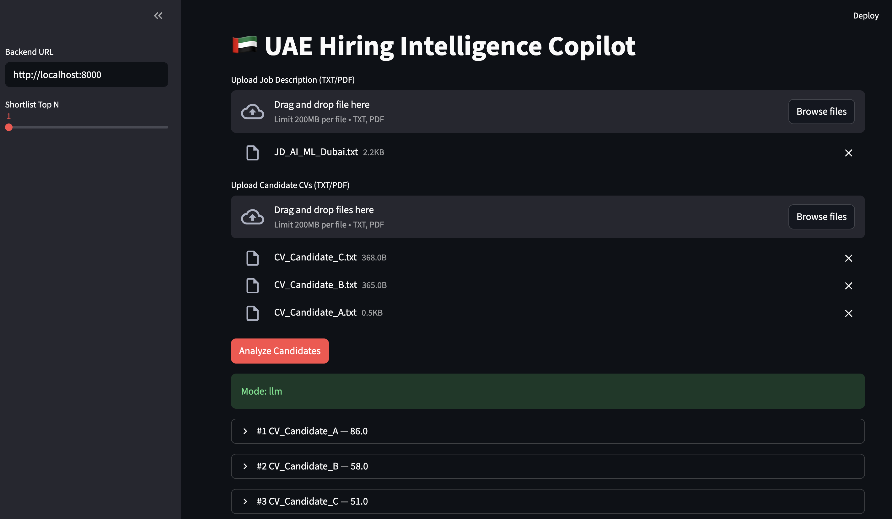

# 🇦🇪 UAE Hiring Intelligence Copilot

Production-style MVP for recruiter workflows: JD/CV ingestion, deterministic scoring, shortlist ranking, explainability, and interview question generation with a multi-agent pattern.

## Highlights

- **FastAPI backend** for `/analyze` and `/health`
- **Strands multi-agent flow**:
  - Orchestrator agent
  - Scorer agent
  - Interview-question agent
- **Vendor-agnostic LLM config** via `.env`:
  - Groq / OpenAI / Anthropic / Ollama
- **Graceful fallback mode**: when no LLM key is present, pipeline automatically runs deterministic rule-based mode
- **Streamlit UI** for JD + multi-CV upload and ranked output view
- **PDF/TXT parser** using `pypdf`, falling back to plain text decode
- **Tests**: unit + API integration
- **CI**: GitHub Actions lint + test
- **Docker**: backend + frontend with `docker-compose`
- **Demo assets**: sample JD + 3 realistic CVs
- **Smoke script** for quick end-to-end check

---

## Architecture

```text
frontend (Streamlit)
   -> POST /analyze (multipart: JD + CVs)
backend (FastAPI)
   -> parser (PDF/TXT)
   -> feature extractor (deterministic)
   -> scorer (skills/experience/education weighted)
   -> multi-agent layer (Strands): explanation + interview questions
      -> LLM provider (Groq/OpenAI/Anthropic/Ollama)
      -> fallback to rule-based if key unavailable
   -> ranked candidates response
```

### Scoring Model (Deterministic)

- Skills match: **70%**
- Experience match: **20%**
- Education alignment: **10%**

This guarantees stable output for baseline evaluation and keyless operation.

---

## Screenshots

### Demo UI (anonymized sample run)




---

## Local Run

```bash
python3 -m venv .venv
source .venv/bin/activate
pip install -r requirements.txt
cp .env.example .env
```

### Backend

```bash
uvicorn backend.main:app --reload --host 0.0.0.0 --port 8000
```

### Frontend

```bash
streamlit run frontend/streamlit_app.py
```

---

## API Usage

### Health

```bash
curl http://localhost:8000/health
```

### Analyze

```bash
curl -X POST http://localhost:8000/analyze \
  -F "shortlist_top_n=3" \
  -F "jd_file=@data/samples/sample_jd.txt" \
  -F "cv_files=@data/samples/candidate_ahmed.txt" \
  -F "cv_files=@data/samples/candidate_sana.txt" \
  -F "cv_files=@data/samples/candidate_omar.txt"
```

---

## Model Provider Switching (No Code Change)

In `.env`:

### Groq (recommended)

```env
LLM_VENDOR=groq
LLM_MODEL=groq/llama-3.1-8b-instant
GROQ_API_KEY=your_key_here
```

### OpenAI

```env
LLM_VENDOR=openai
LLM_MODEL=gpt-4o-mini
OPENAI_API_KEY=your_key_here
```

### Anthropic

```env
LLM_VENDOR=anthropic
LLM_MODEL=claude-3-5-sonnet-20241022
ANTHROPIC_API_KEY=your_key_here
```

### Ollama (local)

```env
LLM_VENDOR=ollama
LLM_MODEL=ollama/qwen2.5:7b-instruct
OLLAMA_BASE_URL=http://localhost:11434
```

---

## Cost-Aware Modes

- **Mode A (cheapest): rule-based only** — leave API key empty
- **Mode B (balanced): rule-based scoring + LLM explanations/questions**
- **Mode C (premium): stronger hosted models for richer recruiter narratives**

Tip: keep deterministic scoring for shortlist integrity; use LLM for qualitative overlays.

---

## Tests

```bash
pytest -q
```

## Smoke Test

```bash
python scripts/smoke_test.py
```

---

## Docker

```bash
cp .env.example .env
docker compose up --build
```

- Backend: `http://localhost:8000`
- Frontend: `http://localhost:8501`

---

## Deployment Options

- **Railway**: easy Docker deploy, env vars in dashboard
- **Render**: separate web services for API + Streamlit
- **Fly.io**: single or split apps with Dockerfiles

Use the included Dockerfiles as the base artifact for all targets.

---

## Repo Structure

```text
backend/
  app/
    agents/
    api/
    core/
    services/
  main.py
frontend/
  streamlit_app.py
data/samples/
scripts/smoke_test.py
tests/
.github/workflows/ci.yml
```

## Security Notes

- No API keys are committed.
- Configure secrets only in `.env` / deployment secret manager.
- `.gitignore` blocks local secret files.
